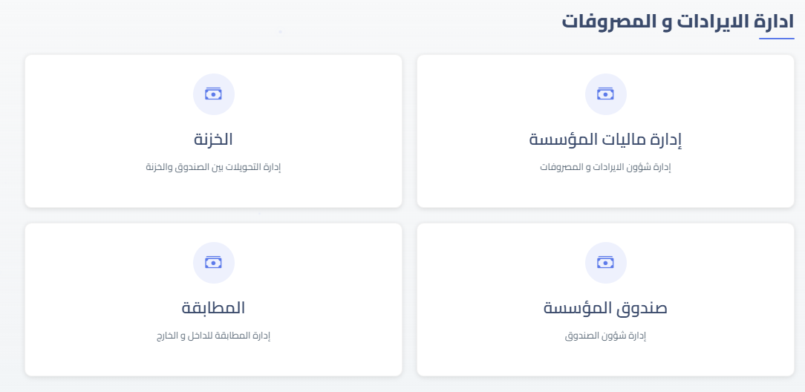

# Notika - نظام إدارة ذكي للمؤسسات التعليمية

**Notika** هو نظام إدارة ذكي متكامل للمؤسسات التعليمية (مدارس، سناتر، معاهد)، يتيح لك إدارة الطلاب، المعلمين، الشؤون المالية، الحضور، التقارير، وأكثر بسهولة واحترافية.

## الميزات الرئيسية

- إدارة الطلاب، المعلمين، والموظفين 👨‍🎓
- نظام مالي متكامل 💰
- تتبع الحضور والدرجات 📊
- صلاحيات منفصلة لكل دور 🔑
- إعدادات مرنة وقابلة للتخصيص ⚙️
- تقارير فورية وذكية 📈
- دعم فني متواصل 🛠️
- تطبيقات مخصصة لكل فئة 📱

## صور من النظام

## تواصل معنا

- 📱 موبايل وواتساب: [+20 10 96371170](https://wa.me/201096371170)
- ✉️ البريد الإلكتروني: [qomra@outlook.com](mailto:qomra@outlook.com)
- 🔗 فيسبوك: [Qomrasoft](https://www.facebook.com/people/Qomrasoft/61579154210390/)

---

## الترخيص

جميع الحقوق محفوظة © قُمرة
